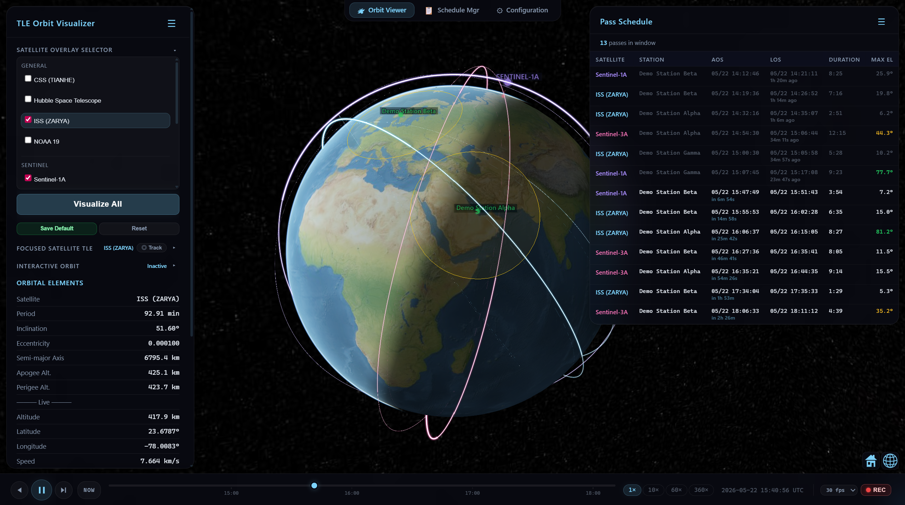
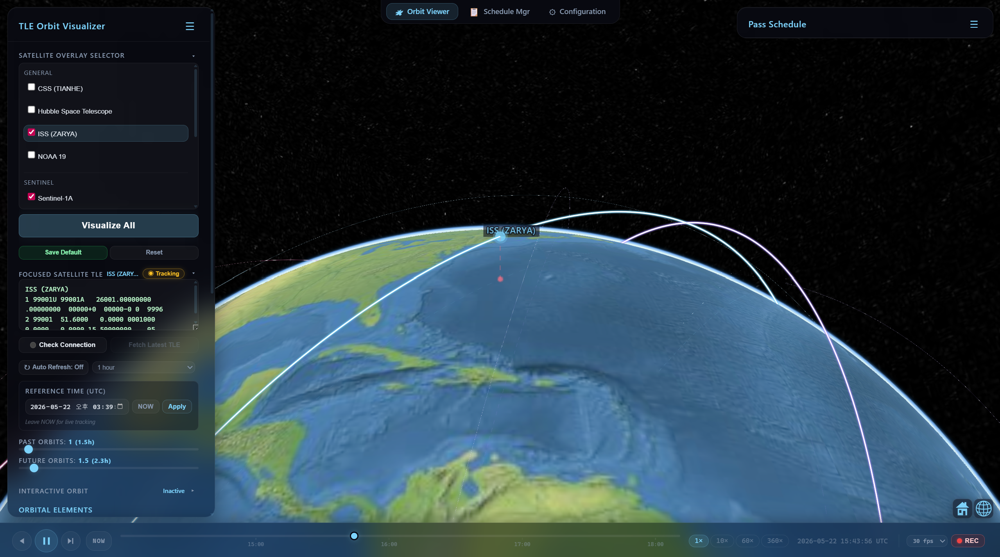
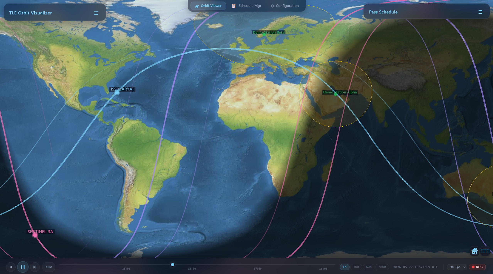
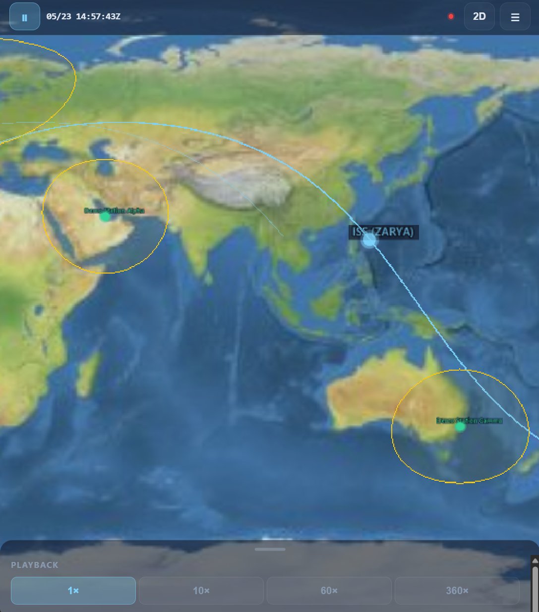
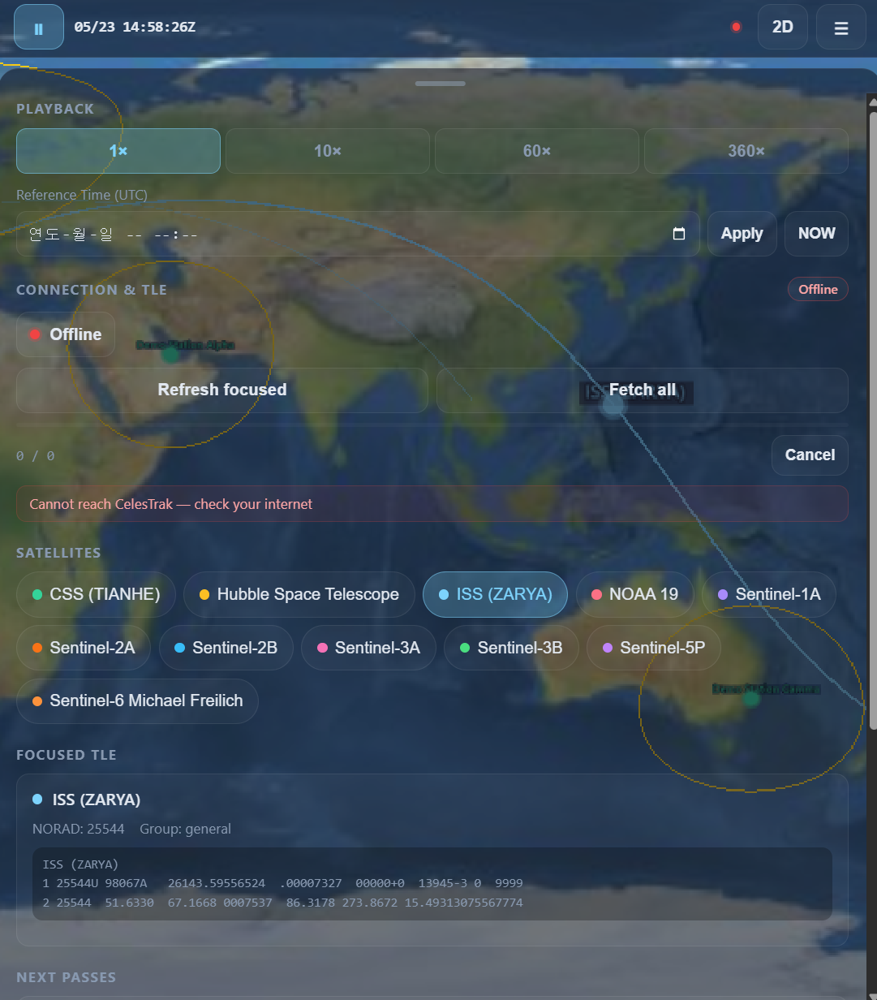
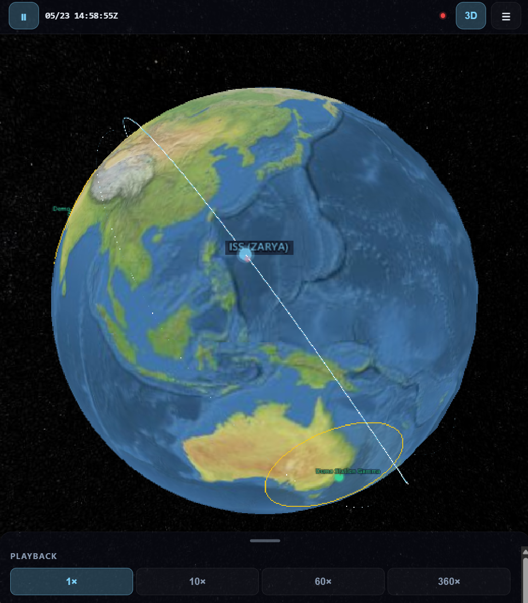

# TLE Visualize — Operation Handbook

**버전**: v1.0.0 (Initial public release)

---

## 목차

1. [시스템 개요](#1-시스템-개요)
2. [시스템 구성](#2-시스템-구성)
3. [설치 및 실행](#3-설치-및-실행)
4. [탭 구성](#4-탭-구성)
5. [Orbit Viewer 탭](#5-orbit-viewer-탭)
6. [Configuration 탭](#6-configuration-탭)
7. [Schedule Manager 탭 (개요)](#7-schedule-manager-탭-개요)
8. [Gantt 타임라인 (Schedule Manager 내장)](#8-gantt-타임라인-schedule-manager-내장)
9. [TLE 관리](#9-tle-관리)
10. [Pass Schedule](#10-pass-schedule)
11. [Playback Bar & 녹화](#11-playback-bar--녹화)
12. [데이터 저장](#12-데이터-저장)
13. [알려진 제한사항](#13-알려진-제한사항)
14. [문제 해결](#14-문제-해결)
15. [모바일 페이지 (/m/)](#15-모바일-페이지-m)

---

## 1. 시스템 개요

TLE Visualize는 **TLE 기반 위성 궤도 시각화 + 다위성 교신 스케줄 관리 시스템**입니다.



### 주요 기능

- 3D 지구 위 다중 위성 궤도 실시간 시각화 (네이티브 해상도)
- 2D Mercator 평면 투영 — 씬 모드 피커로 즉시 전환, 궤도가 ground track으로 투영됨
- 지상국 기준 교신 가능 시간(Pass Schedule) 자동 계산
- 임의 UTC 시점 기준 시각화 (Reference Time)
- 위성 카메라 추적 (Track) — 북반구 항상 위쪽으로 고정
- TLE 자동/수동 갱신 (CelesTrak fetch, Auto Refresh, 수동 입력)
- TLE 생성기 3종 — 분리 벡터 / 6 고전 궤도요소 / Interactive Keplerian Sliders
- 화면 녹화 (좌측 패널 + 3D + Playback Bar 포함 WebM)
- 다위성 일괄 pass 계산, 안테나 단위 충돌 검출
- Gantt 타임라인 (확대/축소/필터/일괄 선택) — Schedule Manager 내장
- 그룹 단위 분류 + `schedulable` 플래그로 표시 대상 제어
- SQLite 영구 저장

### 기술 스택

| 구성 | 기술 |
|---|---|
| **프론트엔드** | Vanilla JS, Cesium.js (3D Globe), Vite 8 |
| **백엔드** | Node.js, Express 5 |
| **데이터베이스** | SQLite (better-sqlite3) |
| **궤도 계산** | satellite.js (SGP4 전파) |
| **TLE 소스** | CelesTrak GP API (NORAD/Space-Track 기반) |

---

## 2. 시스템 구성

```
TLE Visualize
├── 프론트엔드 (브라우저)
│   ├── Orbit Viewer 탭     — 3D 궤도 + Pass Schedule + 녹화
│   ├── Schedule Manager 탭 — 다위성 pass 계산 + 충돌 + Gantt
│   └── Configuration 탭    — 위성/지상국/안테나/매핑 관리
│
├── 백엔드 서버 (Node.js + Express, 포트 3001)
│   ├── REST API   — 위성/지상국/안테나/매핑/마스크/Pass/Settings CRUD
│   └── SQLite DB  — data/schedule.db
│
└── 외부 연동
    └── CelesTrak GP API — TLE 조회 / 검색
```

### 디렉토리 구조

```
프로젝트 루트/
├── server.js              — 백엔드 서버 (REST API + SQLite)
├── index.html             — 메인 HTML
├── docs/
│   └── Operation_Handbook.md
├── src/
│   ├── main.js            — 앱 진입점 (Cesium init, devicePixelRatio, preserveDrawingBuffer)
│   ├── style.css          — 글래스모피즘 전체 스타일
│   ├── orbit.js           — TLE 파싱, SGP4 전파 (referenceDate 지원)
│   ├── visualization.js   — Cesium 엔티티 생성 (테이퍼 궤적, 고해상도 라벨)
│   ├── pass-prediction.js — 교신 시간 계산 (방위각 마스크 지원)
│   ├── separation-vector.js — ECEF 상태벡터 / 6 고전요소 → TLE 변환
│   ├── tle-fetch.js       — CelesTrak GP API 통신 (fetch + 이름/NORAD 검색)
│   ├── presets.js         — 기본 위성 프리셋
│   ├── ground-stations.js — 기본 지상국 데이터
│   ├── core/
│   │   ├── api.js         — REST API 클라이언트
│   │   ├── app-store.js   — 클라이언트 상태 관리 (subscribe/patch/getState)
│   │   ├── azimuth-mask.js  — CSV 파서 + 보간
│   │   └── conflict-detection.js — 안테나 단위 충돌 검출
│   ├── tabs/
│   │   ├── orbit-viewer.js     — Orbit Viewer 탭
│   │   ├── schedule-manager.js — Schedule Manager 탭 (Gantt 타임라인 포함)
│   │   ├── timeline-view.js    — Gantt 타임라인 (Schedule Manager 내장)
│   │   └── configuration.js    — Configuration 탭
│   └── ui/
│       └── tab-bar.js
└── data/
    └── schedule.db        — SQLite 데이터베이스 (자동 생성)
```

---

## 3. 설치 및 실행

### 사전 요구사항

- **Node.js** 18 이상
- **npm** (Node.js 포함)
- **Chromium 계열 권장** (Recording 기능에는 `MediaRecorder` + `getDisplayMedia` 지원 필요)

### 설치

```bash
git clone <repository-url>
cd TLE_Visualize
npm install
```

### 실행

```bash
# 1. 백엔드 서버 (포트 3001)
npm run server

# 2. 프론트엔드 개발 서버 (포트 5173, /api → :3001 프록시)
npm run dev
```

브라우저에서 `http://localhost:5173` 접속.

### 프로덕션 빌드

```bash
npm run build      # dist/ 폴더에 정적 파일 생성
npm run server     # 백엔드 유지
# dist/ 를 정적 파일 서버로 서빙하고 /api 를 :3001로 프록시
```

---

## 4. 탭 구성

화면 상단에 3개 탭.

| 탭 | 아이콘 | 설명 |
|---|---|---|
| **Orbit Viewer** | 🛰 | 3D 궤도 시각화 / Pass Schedule / 인터랙티브 궤도 / 녹화 |
| **Schedule Mgr** | 📋 | 다위성 pass 일괄 계산 / 충돌 검출 / Gantt 보기 |
| **Configuration**| ⚙ | 위성 / 지상국 / 안테나 / 매핑 관리 |

탭 전환 시 Cesium 3D Globe는 Orbit Viewer 탭에서만 가시화됩니다. Pass Schedule 우측 패널과 Playback Bar도 Orbit Viewer 전용입니다.

---

## 5. Orbit Viewer 탭

앱 시작 시 기본으로 표시되는 메인 화면입니다.

### 5.1 화면 구성

```
┌──────────────────────────────────────────────────────────┐
│ [Orbit Viewer] [Schedule Mgr] [Configuration]            │ 탭 바
├───────────┬──────────────────────────────┬────────────────┤
│ 좌측 패널 │       3D 지구 (Cesium)        │ 우측 패널      │
│ (접기 가능)│                              │ Pass Schedule  │
│           │                              │                │
│ • 위성 선택│                              │ • Satellite    │
│ • 포커스   │                              │ • Station      │
│   TLE/연결 │                              │ • AOS / LOS    │
│   Auto Ref │                              │ • Duration     │
│   궤도 설정│                              │ • Max EL       │
│ • 인터랙티브                                                │
│   궤도     │                              │                │
│ • 궤도 정보│                              │                │
│ • 지상국   │                              │                │
├───────────┴──────────────────────────────┴────────────────┤
│ [◀][▶/‖][▶|][NOW] ──●─── 1× 10× 60× 360× ⏱  ● REC 30fps │
└──────────────────────────────────────────────────────────┘
```

### 5.2 좌측 패널 — Satellite Overlay Selector (접기/펼치기)

위성 목록이 그룹별(General, Sentinel 등)로 표시됩니다. Configuration → Groups에서 그룹을 추가·편집·삭제할 수 있고, 그룹의 `schedulable` 플래그를 끄면 해당 그룹의 위성은 이 셀렉터에서 자동으로 숨겨집니다.

**조작 방법**:
- **체크박스**: 해당 위성의 궤도를 3D 지구에 표시/숨김
- **위성 이름 클릭**: 해당 위성에 포커스 (궤도 정보 표시, TLE 편집 가능, Track 가능)
- **Visualize All**: 체크된 모든 위성의 궤적을 3D 지구에 렌더링
- **Save Default**: 현재 선택 상태를 서버에 저장 (다음 접속 시 자동 복원)
- **Reset**: 저장된 기본 선택으로 되돌림

> **참고**: Configuration에서 `enabled`가 꺼진 위성은 이 목록에 표시되지 않습니다.

### 5.3 좌측 패널 — Focused Satellite TLE (접기/펼치기)

포커스한 위성의 TLE 편집·연결 상태·Auto Refresh·Reference Time·궤도 표시 슬라이더가 한 섹션에 모여 있습니다.

#### Track 버튼 (◎ Track)

포커스된 위성을 카메라로 추적합니다. **추적 대상은 위성 ID로 관리**되므로 재시각화(슬라이더 드래그·색상 변경·Auto Refresh)가 일어나도 stale entity가 카메라를 잡고 흔드는 일이 없습니다.



**3가지 상태**:

| 상태 | 라벨 | 동작 |
|---|---|---|
| **Focused == Tracked** | `◉ Tracking` (강조) | 포커스 위성이 추적 중 → 클릭하면 **중단** |
| **Focused ≠ Tracked** (다른 위성 추적 중) | `◎ Track` | 다른 위성이 추적 중 → 클릭하면 **포커스 위성으로 전환** (이전 대상 자동 해제) |
| **추적 없음** | `◎ Track` | 클릭하면 포커스 위성 **추적 시작** |

각 상태에서 **마우스 호버 tooltip** 으로 현재 추적 대상과 클릭 시 동작이 정확히 안내됩니다 (예: `Currently tracking Sentinel-1A. Click to switch to ISS.`).

**추적 카메라 동작**:
- 위성 직하점(sub-satellite point)을 lookAt 타겟으로 사용
- heading=0°로 고정 → **북반구가 항상 화면 위쪽**
- 사용자가 마우스 휠로 줌인/아웃한 거리는 유지됨
- 2D / Columbus 모드에서는 자동으로 추적 중단 (3D 복귀 시 재개)

**자동 중단**:
- 셀렉터에서 추적 중인 위성을 체크 해제 → 자동 중단
- 추적 중인 위성을 삭제 → 자동 중단
- 추적이 중단되면 카메라 transform이 해제되고 **지구가 화면 중앙에 오도록 자동 재정렬**됨 (사용자의 줌 거리는 보존)

#### Check Connection / Fetch Latest TLE

| 버튼 | 기능 |
|---|---|
| **Check Connection** | CelesTrak 서버 연결 상태 확인 |
| **Fetch Latest TLE** | 포커스된 위성의 최신 TLE를 CelesTrak에서 조회 → 서버 DB에 저장 |

#### Auto Refresh TLE

자동 갱신 토글로, 활성화하면 선택한 주기(30 min / 1 hour / 2 hours / 6 hours)마다 enabled 위성의 TLE을 일괄 fetch합니다.

- 활성화 즉시 1회 fetch 실행
- 각 fetch 성공 후 store 갱신 → 궤적과 Pass Schedule이 자동 재렌더 (카메라는 유지)
- 상태 표시: `14:30 UTC · 5ok`

#### Focused Satellite TLE 편집

위성 이름을 클릭하면 해당 위성의 TLE가 textarea에 표시됩니다.
- TLE를 편집 후 **Visualize All**을 누르면 수정된 TLE로 궤도가 다시 계산됩니다 (메모리 상 임시)
- 영구 저장하려면 Configuration 탭에서 수정하세요

#### Reference Time (UTC)

특정 시점의 궤도를 시각화하는 컨트롤입니다.

- **datetime-local 입력**: 기준 시각
- **NOW**: 라이브(실시각) 모드 복귀
- **Apply**: 입력한 시각 기준으로 재시각화
- Past/Future Orbits 슬라이더가 이 기준 시각을 중심으로 propagate
- Pass Schedule도 동일 기준으로 재계산
- 카메라는 유지 (skipZoom)

#### Past Orbits / Future Orbits

| 슬라이더 | 범위 | 설명 |
|---|---|---|
| **Past Orbits** | 0.5 ~ 16 | 기준 시각 대비 과거 궤적 표시 범위 (궤도 수) |
| **Future Orbits** | 0.5 ~ 16 | 기준 시각 대비 미래 궤적 표시 범위 (궤도 수) |

슬라이더 드래그 종료 시(`change` 이벤트) 궤도 재계산.

### 5.4 좌측 패널 — Interactive Orbit (접기/펼치기)

**6 고전 궤도요소를 즉석에서 슬라이더로 조작**하여 궤도 변화를 관찰하는 시연 도구.

| 요소 | 범위 | 기본값 |
|---|---|---|
| **a** (반장축, km) | 6500 ~ 42500 | 6778 |
| **e** (이심률) | 0 ~ 0.95 | 0.0001 |
| **i** (경사각, °) | 0 ~ 180 | 51.64 |
| **Ω** (RAAN, °) | 0 ~ 360 | 100 |
| **ω** (근지점 편각, °) | 0 ~ 360 | 0 |
| **ν** (진근점 이각, °) | 0 ~ 360 | 0 |

각 행에 **슬라이더 + 숫자 입력 박스**가 함께 있어 대략 조정/정밀 입력 모두 가능.

**드래그 중 (`input` 이벤트) — 라이브 프리뷰**

슬라이더 또는 숫자 박스를 움직이는 동안에는 **50ms throttle (~20 fps)** 로 in-memory만 갱신해서 궤도가 즉시 변하는 모습을 보여 줍니다. API 호출은 일어나지 않습니다.

- 상태 라벨: `Live preview · alt ~XXX km · period XX min`
- 매 input 이벤트마다 throttle 타이머에 마지막 값을 보관 → 사용자가 멈춘 위치는 반드시 한 번 더 적용됨
- visualize() 자체는 카메라를 건드리지 않으므로 (skipZoom) 사용자의 시점이 갑자기 튀지 않음

**드래그 종료 (`change` 이벤트) — DB 영속화**

슬라이더에서 손을 떼거나 숫자 박스에서 Enter / blur 하면:

- 같은 in-memory 갱신 한 번 더 + **`updateSatellite` / `createSatellite` API 호출로 서버 DB 저장**
- 상태 라벨: `Updated · alt ~XXX km · period XX min`
- 다음 페이지 로드 시 TLE를 역파싱해 6개 슬라이더의 마지막 상태를 그대로 복원

**공통 동작**:
- DB에 `interactive_kep` ID, 이름 **Interactive Keplerian**, group `custom`, 색상 **노란색 (`#fbbf24`)** 으로 저장 → 다른 위성과 시각적으로 구분
- 자동으로 위성 셀렉터에 추가 + 선택 → 일반 위성처럼 체크 토글 가능
- Track 버튼으로 카메라 추적 가능 (다른 위성과 동일)
- Reference Time이 설정되어 있으면 그 시각이 TLE epoch로 사용됨 (라이브 모드에서는 현재 시각)
- 셀렉터에서 체크 해제하거나 Remove 버튼으로 삭제하면 추적도 자동 중단됨

**버튼**:
- **Create / Update**: 슬라이더와 별도로 명시적 적용 (드래그 없이 숫자만 바꾼 뒤 강제 적용할 때 유용)
- **Reset**: ISS-like 기본값 (a=6778, e=0.0001, i=51.64°, Ω=100°, ω=0°, ν=0°) 으로 복원 후 즉시 재렌더 + DB 영속화
- **Remove**: DB에서 `interactive_kep` 삭제 + 위성 셀렉터에서 제거 + 화면에서 사라짐

### 5.5 좌측 패널 — Orbital Elements

포커스된 위성의 궤도 요소가 표시됩니다.

- Period (주기)
- Inclination (경사각)
- Eccentricity (이심률)
- Semi-major Axis (반장축)
- Apogee / Perigee (원지점 / 근지점)
- Current Altitude / Latitude / Longitude (1초 간격 실시간 갱신)
- Current Speed (실시간 속도)

### 5.6 좌측 패널 — Ground Stations

등록된 지상국 목록이 표시됩니다.
- **Export**: 지상국 정보를 JSON으로 다운로드
- **Manage in Configuration →**: Configuration 탭으로 이동

### 5.7 3D / 2D 지구 (Cesium)

| 조작 | 방법 |
|---|---|
| **회전** | 마우스 좌클릭 드래그 |
| **줌** | 마우스 휠 |
| **기울이기** | 마우스 우클릭 드래그 또는 Ctrl + 좌클릭 드래그 |
| **뷰 모드** | 우상단 아이콘으로 3D / 2D / Columbus 전환 |
| **Home** | 집 아이콘 — **대한민국 영역**으로 이동 |
| **전체화면** | 우상단 전체화면 아이콘 |

**2D Mercator 모드**:



2D 모드 진입 시 자동으로 적용되는 성능 프로필:
- `resolutionScale` 1.0 (CSS 픽셀) — 평면 투영에서는 네이티브 DPR이 불필요
- MSAA off — flat 맵에서 시각적 차이 미미
- lighting / fog / atmosphere off — 2D에서 보이지 않음
- `mapMode2D: ROTATE` (단일 지구 회전, INFINITE_SCROLL의 다중 패스 렌더 회피)

3D로 복귀 시 위 설정이 모두 원복됩니다.

**렌더링 품질 (3D 모드)**:
- `viewer.resolutionScale = devicePixelRatio` 적용 → HiDPI/Retina 디스플레이에서 네이티브 해상도로 렌더링
- FXAA 안티앨리어싱 활성화
- 위성/지상국 라벨은 2.7배 해상도 텍스처로 렌더링되어 어떤 줌에서도 선명

**위성 궤적 표현**:
- 각 위성은 Configuration에서 설정한 고유 색상으로 표시
- 현재 위치에서 가장 굵고, 과거/미래로 갈수록 얇아지는 테이퍼 궤적선 (6 밴드 × 2 방향)
- 위치/색상 변경이 잦은 환경에서도 한 프레임당 ground-polyline 재테셀레이션 비용이 발생하지 않도록 slice index + wall-time 메모이제이션 적용
- 지상국은 황색 핀으로 표시

---

## 6. Configuration 탭

위성·그룹·지상국·안테나·매핑을 관리하는 설정 화면입니다.

### 6.1 화면 구성

좌측에 네비게이션(5개 섹션), 우측에 해당 관리 패널.

| 섹션 | 설명 |
|---|---|
| **Satellites** | 위성 CRUD (CelesTrak 검색, TLE 생성기 포함) |
| **Groups** | 위성 그룹 CRUD (label, color, sort order, `schedulable` 플래그) |
| **Ground Stations** | 지상국 CRUD |
| **Antennas & Masks** | 지상국별 안테나 + 방위각 마스크 |
| **Antenna Mappings** | 안테나 ↔ 위성 매핑 (primary / backup 역할) |

### 6.2 Satellite Management

#### 위성 목록

그룹별로 위성이 테이블 형태로 표시됩니다.

| 열 | 설명 |
|---|---|
| **색상** | 궤도 시각화 색상 (클릭하여 변경 가능) |
| **Name** | 위성 이름 |
| **NORAD ID** | NORAD 카탈로그 번호 (없을 수 있음) |
| **Group** | 분류 그룹 |
| **Epoch** | TLE epoch 날짜 |
| **Active** | 활성/비활성 토글 |
| **Actions** | 편집 / 삭제 |

#### 위성 추가 (+ Add Satellite)

폼에는 4가지 입력 경로가 있습니다.

##### A. CelesTrak 검색

1. 검색창에 위성 이름 또는 NORAD ID 입력 → **Search**
2. 결과에서 원하는 위성 클릭 → 폼 자동 채워짐
3. 필요시 수정 후 **Save**

##### B. 수동 TLE 입력 (CelesTrak에 없는 위성)

1. ID, Name 직접 입력 (NORAD ID는 비워둘 수 있음)
2. TLE textarea에 3-line TLE 붙여넣기:
   ```
   SAT NAME
   1 99001U 26999A   26101.00000000  .00000100  00000+0  30000-4 0  9991
   2 99001  98.7000 145.5000 0001000   0.0000   0.0000 14.01675198    14
   ```
3. Group, Color 선택 후 **Save**

##### C. Generate TLE from Separation Vector

발사체 분리 직후 상태벡터(WGS84 ECEF)로부터 TLE를 생성합니다.

입력 필드:
- **UTC Time of State**: 분리 시각
- **ECEF Position (m)**: `X, Y, Z` 콤마 구분
- **ECEF Velocity (m/s)**: `X, Y, Z` 콤마 구분 (Earth-relative)

**Generate TLE** 클릭 시:
- ECEF→ECI 변환 (자전 보정 `ω × r` 포함)
- 상태벡터 → osculating Keplerian 요소
- SGP4-호환 TLE로 포맷팅
- 위 TLE textarea에 자동 삽입 + 궤도 요약(고도, 주기 등) 표시

##### D. Generate TLE from Classical Orbital Elements

6 고전 궤도요소를 입력해 TLE를 생성합니다.

| 입력 | 단위 | 설명 |
|---|---|---|
| **Epoch UTC** | datetime | 궤도요소 기준 시각 |
| **a** (반장축) | km | 지구반경 6378 km 초과 검증 |
| **e** (이심률) | 0–1 |  |
| **i** (경사각) | ° |  |
| **Ω** (RAAN) | ° |  |
| **ω** (근지점 편각) | ° |  |
| **ν** (진근점 이각) | ° |  |

**Generate TLE** 클릭 시:
- ν → 이심 근점이각 E → M 변환
- a → mean motion 계산
- SGP4-호환 TLE 생성 + 자동 textarea 삽입

> **임의 위성 등록 워크플로 요약**: A·C·D는 폼만 자동으로 채워주는 보조 도구입니다. 어느 경로든 마지막에 **Save**를 눌러야 DB에 등록됩니다.

#### Fetch All TLEs

NORAD ID가 있는 모든 활성 위성의 TLE을 CelesTrak에서 일괄 갱신합니다.

> **주의**: CelesTrak은 미군 Space-Track 데이터를 사용합니다. 운영기관이 자체 추적으로 생성한 TLE와 다를 수 있으며, 이 차이로 인해 pass 예측 시간이 수 분 차이날 수 있습니다.

#### Active 토글

- **켜짐**: Orbit Viewer 목록 표시, Auto Refresh / Fetch All 대상
- **꺼짐**: Orbit Viewer 목록에서 숨김, TLE 일괄 갱신 제외

### 6.3 Ground Station Management

| 열 | 설명 |
|---|---|
| **Name** | 지상국 이름 |
| **Latitude** | 위도 (°) |
| **Longitude** | 경도 (°) |
| **Min Elevation** | 최소 고각 (°) — pass 계산 시 이 각도 이상만 교신 가능으로 판정 |

지상국 추가는 **+ Add Station** → 이름·위도·경도·최소 고각 입력 → **Save**.

### 6.4 Antennas & Masks

지상국을 선택하면 해당 지상국 소속 안테나 카드가 표시됩니다.

**안테나 추가**: **+ Add Antenna** → 이름·유형 입력 → **Save**

**Azimuth Mask (방위각 마스크)**: 안테나가 지형/건물 등에 의해 시야가 가려지는 방위각별 최소 고각 프로파일.

- 안테나 카드에서 **Import Mask CSV** 클릭 → 파일 선택
- 0–360° 구간을 piecewise-linear 보간 (360→0 wraparound 자동 처리)
- pass 계산 시 매 timestep마다 마스크 고도 ≤ 위성 고도일 때만 교신 가능 판정
- mid-pass에 마스크가 가려지면 자동으로 sub-pass로 분할
- **Clear Mask** 버튼으로 마스크 제거 → 지상국 기본 최소 고각으로 복귀

#### CSV 형식 명세

```csv
azimuth_deg,min_elev_deg
0,5.0
10,5.0
20,8.2
30,12.0
40,15.0
50,10.0
60,7.0
70,5.0
80,5.0
90,5.0
100,5.0
110,5.0
120,20.0
130,25.0
140,20.0
150,10.0
160,5.0
170,5.0
180,5.0
190,5.0
200,5.0
210,5.0
220,5.0
230,5.0
240,5.0
250,8.0
260,10.0
270,8.0
280,5.0
290,5.0
300,5.0
310,5.0
320,5.0
330,5.0
340,5.0
350,5.0
```

| 열 | 단위 | 설명 |
|---|---|---|
| `azimuth_deg` | ° | 0–360 (북=0, 동=90, 남=180, 서=270) |
| `min_elev_deg` | ° | 해당 방위각에서의 최소 고각 |

규칙:
- 항목 사이는 **직선 보간 (piecewise-linear)**
- 360° → 0° 래핑 자동 처리 (마지막 점과 첫 점 사이 보간)
- 위 예시는 120~150° 방향에 건물이 있어 최소 고각이 20~25°까지 올라가는 상황

### 6.5 Antenna Mappings

안테나와 위성을 연결하는 트리뷰. **지상국 → 안테나 → 위성** 계층으로 표시됩니다.

- 안테나 노드에 매핑할 위성 선택 + Role(primary / backup) 선택 → **Add**
- 매핑된 위성 옆 Role 드롭다운으로 primary/backup 변경
- Schedule Manager의 충돌 검출은 동일 안테나에 매핑된 다른 위성과의 시간 겹침을 검사합니다.

---

## 7. Schedule Manager 탭 (개요)

`schedulable=true`로 표시된 모든 그룹의 위성에 대한 **다위성 일괄 pass 계산**과 **안테나 충돌 검출** 도구.

> 어떤 그룹을 Schedule Manager에서 제외하려면 Configuration → Groups에서 해당 그룹의 `Schedulable` 토글을 끄면 됩니다. 기본 시드는 General + Sentinel 두 그룹 모두 schedulable=true 입니다.

### 7.1 사용 흐름

1. 좌측 패널에서 계산할 위성 다중 선택
2. **Time Window** — Start / End UTC 입력 (기본: 지금 ~ +24h)
3. **Compute Passes** 클릭

내부적으로:
- 각 위성 × 모든 지상국 × 모든 활성 안테나 조합에 대해 SGP4 propagate
- 안테나 매핑(primary/backup)에 따라 패스에 안테나 자동 배정
- 방위각 마스크가 있으면 적용 (서브패스 분할 포함)
- 동일 안테나에서 시간이 겹치는 패스를 충돌로 표시
- 결과는 서버 DB에 저장 (재방문 시 재로딩됨)

### 7.2 결과 테이블

| 열 | 설명 |
|---|---|
| **Satellite** | 위성 이름 + 고유 색상 dot |
| **Station** | 지상국 |
| **Antenna** | 배정된 안테나 (미배정 시 `—`) |
| **AOS** | 신호 획득 시각 (UTC) |
| **LOS** | 신호 소실 시각 (UTC) |
| **Duration** | 교신 지속 시간 |
| **Max EL** | 최대 고각 (60°↑ 초록, 30°↑ 노랑) |
| **Status** | 상태 뱃지 (클릭하여 전환) |
| **Conflict** | 충돌 시 ⚠ |

- 열 헤더 클릭으로 정렬
- 컬럼별 다중 선택 필터 (Satellite / Station / Antenna / Status / Conflict)
- Min EL 숫자 필터로 고각 임계 이하 패스 숨김

### 7.3 상태 워크플로우

상태 뱃지를 클릭하여 순환 전환합니다.

```
predicted → selected → confirmed → predicted (순환)
```

별도의 **Reject** 동작으로:

```
rejected ↔ predicted (토글)
```

#### 상태 뱃지

| 상태 | 의미 | 색상 |
|---|---|---|
| `predicted` | 계산 결과, 미결정 | 회색 |
| `selected` | 스케줄 후보로 선택됨 | 파란색 |
| `confirmed` | 운영 확정 | 초록색 |
| `rejected` | 거부됨 | 빨간색 |
| `cancelled` | 취소됨 | 흐릿한 회색 |

#### 일괄 변경

테이블에서 여러 행을 선택(Shift/Ctrl 클릭) 후 하단 **Bulk** 컨트롤로 상태를 일괄 전환 가능.

### 7.4 충돌 검출

동일 안테나에 시간이 겹치는 두 개 이상의 패스가 존재하면:
- 해당 행의 Conflict 열에 ⚠ 표시
- 툴팁에 겹친 위성·지상국·겹침 시간(seconds) 표시
- 미배정 패스(`Antenna = —`)는 충돌 검사에서 **제외**

내부 알고리즘: AOS 기준 정렬 후 sweep 검사 (`src/core/conflict-detection.js`).

### 7.5 Antenna Mappings 트리 (참고)

Schedule Manager에서 사용하는 안테나 매핑은 Configuration 탭의 **Antenna Mappings** 섹션에서 관리합니다. 트리 구조 예:

```
▸ Demo Station Alpha                [2 antennas]
  ▾ Demo Antenna A1                 [3 satellites]
    • Sentinel-1A       primary [×]
    • Sentinel-3A       primary [×]
    • ISS (ZARYA)       backup  [×]
    [+ Add satellite ▾] [Add]
  ▸ Demo Antenna A2                 [1 satellite]
```

매핑되지 않은 위성은 패스가 계산되어도 안테나가 배정되지 않습니다 (충돌 검사 대상에서 자동 제외).

### 7.6 출력

- **Export CSV** — 현재 필터링된 결과를 CSV로 다운로드
  - 컬럼: Satellite, Station, Antenna, AOS (UTC), LOS (UTC), Duration (min), Max EL, Status, Conflict
  - 파일명: `schedule_YYYY-MM-DD.csv`
- **Gantt 모드** — 동일 데이터를 그래픽 Gantt 차트로 토글 보기 (§8 참고)
- 우상단 미니 시간 컨트롤로 윈도우를 좌우로 이동 + **Recompute** 가능

---

## 8. Gantt 타임라인 (Schedule Manager 내장)

다위성 pass를 **인터랙티브 Gantt 차트**로 가시화. Schedule Manager 탭 상단의 **Table / Gantt 토글**에서 Gantt를 선택하면 동일한 영역에 표시됩니다 (별도의 탭 아님).

### 8.1 화면 구성

- **좌측**: 지상국 이름 (행 라벨)
- **우측 상단**: 시간 축 (자동 tick 간격, 자정·정오 강조)
- **우측 본문**: 지상국 행마다 위성별 색상 pass bar

### 8.2 줌·스크롤

| 조작 | 동작 |
|---|---|
| **+** 버튼 | 줌 인 (시간축 확대) |
| **−** 버튼 | 줌 아웃 |
| **Fit** 버튼 | 전체 시간 범위에 맞춤 |
| **Ctrl+스크롤 휠** | 마우스 위치 기준 줌 |
| **수평 스크롤** | 시간축 좌우 이동 |

### 8.3 패스 바 표현

각 위성별 고유 색상으로 표시되며, **상태에 따라 투명도**가 달라집니다.

| 상태 | 투명도 |
|---|---|
| `confirmed` | 100% |
| `selected` | 70% |
| `predicted` | 50% |
| `rejected` / `cancelled` | 30% |

### 8.4 충돌 표시

같은 지상국 행에서 시간이 겹치는 패스 영역에 **빨간 반투명 오버레이**가 표시됩니다 (Schedule Manager의 충돌 검출 결과와 동일).

### 8.5 패스 선택

- **클릭**: 단일 선택 → 하단 상세 패널 표시
- **Shift+클릭**: 다중 선택 토글
- 선택한 패스는 Schedule Manager 테이블 보기와 동일하게 하단 Bulk 컨트롤로 상태 일괄 전환 가능

### 8.6 호버 툴팁

패스 바에 마우스를 올리면 표시:
- 위성명, 지상국, 안테나
- AOS, LOS, Duration, Max EL
- 현재 상태

> Gantt와 Table은 동일한 Schedule Manager 데이터를 보여주는 두 가지 표현입니다. 워크플로우에 따라 둘 중 편한 표현으로 분석하면 됩니다.

---

## 9. TLE 관리

### 9.1 TLE란?

TLE(Two-Line Element Set)는 인공위성의 궤도를 기술하는 표준 형식입니다. SGP4 전파 모델과 함께 사용하여 위성의 과거/현재/미래 위치를 계산합니다.

### 9.2 TLE 소스

| 소스 | 설명 | 사용 방법 |
|---|---|---|
| **CelesTrak (NORAD)** | 미군 Space-Track 기반, 공개 TLE | Fetch Latest TLE / Fetch All TLEs / Auto Refresh |
| **기관 자체 TLE** | 운영기관의 자체 궤도결정 결과 | Configuration에서 수동 입력 |
| **임의 TLE (분리 벡터)** | 발사 직후 상태벡터로부터 생성 | Configuration → Add Satellite → Separation Vector 폼 |
| **임의 TLE (6 요소)** | 6 고전 궤도요소로부터 생성 | Configuration → Add Satellite → Classical Orbital Elements 폼 |
| **인터랙티브 슬라이더** | 6 고전 요소를 슬라이더로 즉석 조작 | Orbit Viewer → Interactive Orbit 패널 |

### 9.3 TLE 신선도

TLE는 시간이 지나면 정확도가 떨어집니다.

| TLE 경과 시간 | 예상 위치 오차 (LEO) | AOS/LOS 오차 |
|---|---|---|
| **1일 이내** | < 1 km | < 수초 |
| **3~5일** | 수 km | 수십초 ~ 1분 |
| **7~14일** | 수십 km | 2~5분 |
| **30일 이상** | 수백 km | 부정확 |

> **권장**: 운영 용도에서는 Auto Refresh를 1시간 주기로 켜두거나, 최소 매일 Fetch All TLEs를 실행하세요.

### 9.4 NORAD TLE vs 기관 TLE

CelesTrak에서 제공하는 TLE(NORAD)와 운영기관이 자체 추적으로 생성한 TLE는 **궤도결정 소스가 다르므로 동일 위성이라도 pass 예측 시간에 수분 차이**가 발생할 수 있습니다.

정밀한 pass 예측이 필요한 경우:
1. 기관으로부터 TLE를 받아
2. Configuration → 해당 위성 편집 → TLE textarea에 붙여넣기
3. **Save**

### 9.5 생성된 TLE의 정밀도

- 분리 벡터 / 6 고전요소 / Interactive Slider로 생성된 TLE는 **osculating Keplerian elements** 기준입니다.
- SGP4 자체는 **mean elements** 모델 — 둘 사이에는 short-period 편차가 존재 (수 ~ 수십 m / 0.01%~0.05% 수준).
- 시각화 및 단기 시연 용도로는 충분히 정확합니다. 운영급 정밀도가 필요하면 Brouwer-Lyddane mean conversion이 필요하나 현재 미지원.

---

## 10. Pass Schedule

### 10.1 개요

Orbit Viewer 우측 패널에 표시되는 교신 가능 스케줄.

### 10.2 표시 항목

| 열 | 설명 |
|---|---|
| **Satellite** | 위성 이름 (고유 색상 dot 표시) |
| **Station** | 지상국 이름 |
| **AOS** | Acquisition of Signal — 교신 시작 시각 (UTC) |
| **LOS** | Loss of Signal — 교신 종료 시각 (UTC) |
| **Duration** | 교신 지속 시간 |
| **Max EL** | 최대 고각 (°) — 값이 높을수록 양호한 교신 조건 |

### 10.3 계산 범위

Pass Schedule의 시간 범위는 **궤도 시각화 범위(Past/Future Orbits 슬라이더 + Reference Time)** 에 의해 결정됩니다. 더 넓은 범위를 보려면 Future Orbits를 늘리세요.

### 10.4 계산 기준

- 등록된 **모든 지상국**에 대해 교신 가능 시간을 계산합니다 (안테나 매핑과 무관)
- 각 지상국의 **최소 고각(Min Elevation)** 이상일 때 교신 가능으로 판정
- 계산 엔진은 SGP4 전파 모델(satellite.js)을 사용

### 10.5 Pass 클릭

Pass Schedule의 행을 클릭하면 해당 pass 시점으로 카메라가 이동합니다.

---

## 11. Playback Bar & 녹화

화면 하단에 위치한 시간 제어 + 녹화 바.

### 11.1 시간 컨트롤

| 버튼 | 기능 |
|---|---|
| **◀** | 역방향 재생 |
| **▶ / ‖** | 재생 / 일시정지 |
| **▶\|** | 한 스텝 전진 |
| **NOW** | 현재 시각(실시간)으로 이동 |

### 11.2 배속

| 버튼 | 배속 |
|---|---|
| **1×** | 실시간 |
| **10×** | 10배속 |
| **60×** | 60배속 (1분 = 1초) |
| **360×** | 360배속 (6분 = 1초) |

> **재시각화 시 보존**: Interactive Orbit 슬라이더 드래그 / Auto Refresh / Past·Future Orbits 슬라이더 / 색상·enabled 변경 등 **암시적 재렌더**가 일어나도 사용자가 선택한 **재생 속도와 현재 시각은 그대로 유지**됩니다. 시각 점프는 **Reference Time의 NOW / Apply** 버튼처럼 명시적으로 시간을 바꾸는 동작에서만 발생합니다.

### 11.3 타임라인 스크러버

스크러버를 드래그하여 원하는 시점으로 이동할 수 있습니다. 현재 시각이 우측에 UTC로 표시됩니다.

### 11.4 화면 녹화

화면 우측 끝에 fps 셀렉터 + Record 버튼.

| 컨트롤 | 기능 |
|---|---|
| **fps 셀렉터** | 24 / 30 / 60 fps 선택 |
| **● REC** | 녹화 시작 → 브라우저가 공유할 surface 선택을 요청 |
| **(녹화 중) STOP** | 녹화 종료 + 자동 WebM 다운로드 |

**캡처 범위**:
- 시작 시 브라우저 다이얼로그에서 **"이 탭"** 선택 → 좌측 패널 + 3D 지구 + Playback Bar 등 **탭 전체** 녹화
- 다른 창/모니터를 선택하면 해당 영역 녹화
- 사용자가 브라우저의 "공유 중지" 버튼을 누르면 자동으로 녹화 종료

**출력**:
- 단일 `.webm` 파일 (`orbit-recording_YYYY-MM-DD_HH-MM-SS.webm`)
- 코덱: VP9 → VP8 → WebM → MP4 우선순위 (브라우저 지원에 따라)
- 비트레이트: 12 Mbps (고화질)

**고배속 재생 시**:
- `MediaRecorder`는 캔버스가 갱신되는 매 프레임을 캡처하므로, 60× / 360× 재생 시에도 부드러운 영상이 만들어집니다.
- 더 매끄러운 결과를 원하면 60fps로 설정하세요.

---

## 12. 데이터 저장

모든 데이터는 **서버의 SQLite 데이터베이스**(`data/schedule.db`)에 영구 저장됩니다.

### 저장되는 데이터

| 데이터 | 테이블 | 설명 |
|---|---|---|
| 위성 정보 | `satellites` | 이름, NORAD ID, TLE, 색상, 그룹, 활성 상태 |
| 지상국 정보 | `stations` | 이름, 위도, 경도, 최소 고각 |
| 안테나 정보 | `antennas` | 이름, 소속 지상국, 유형 |
| 방위각 마스크 | `antenna_masks` | 안테나별 azimuth/elevation 페어 |
| 안테나-위성 매핑 | `antenna_mappings` | antennaId, satelliteId, role(primary/backup) |
| Pass 결과 | `passes` | 위성-지상국별 AOS/LOS/MaxEL/상태/충돌 |
| 사용자 설정 | `settings` | Orbit Viewer 기본 위성 선택, Schedule Manager 기본 선택 등 |

### 초기 데이터

최초 서버 시작 시 `presets.js`와 `ground-stations.js`의 기본 데이터가 DB에 자동 seed됩니다.

> **참고**: DB를 초기화하려면 `data/schedule.db` 파일을 삭제하고 서버를 재시작하면 됩니다.

---

## 13. 알려진 제한사항

| 항목 | 설명 |
|---|---|
| **TLE 정확도** | SGP4 모델은 고궤도/이심률 큰 위성에 대해 정밀도가 낮음. LEO에 최적화 |
| **CelesTrak 갱신 주기** | 일부 위성은 CelesTrak에서 TLE 갱신이 며칠간 지연될 수 있음 |
| **NORAD vs 기관 TLE** | CelesTrak TLE와 운영기관 TLE 간 수분 차이 발생 가능 |
| **Osculating vs Mean elements** | 분리 벡터/6 요소/슬라이더로 생성된 TLE는 osculating 요소 기반이라 SGP4 mean 모델과 short-period 편차 존재 |
| **대기 굴절** | 현재 pass 계산은 순수 기하학적 horizon 기준이며, 대기 굴절 보정 미적용 |
| **녹화 권한 다이얼로그** | 보안상 매 녹화 시작 시 브라우저가 화면 공유 다이얼로그 표시 |
| **InfoBox 경고** | Cesium InfoBox의 `about:blank` sandbox 경고가 콘솔에 표시되나 기능에 영향 없음 |
| **동시 접속** | SQLite 특성상 다수 동시 쓰기 시 성능 저하 가능 |

---

## 14. 문제 해결

### 위성 궤적이 표시되지 않음

1. 좌측 패널에서 위성이 **체크**되어 있는지 확인
2. **Visualize All** 버튼을 클릭했는지 확인
3. Configuration에서 해당 위성의 **Active**가 켜져 있는지 확인
4. 해당 위성에 유효한 TLE가 등록되어 있는지 확인

### Pass Schedule이 비어 있음

1. **Visualize All**을 먼저 실행해야 pass가 계산됩니다
2. **Future Orbits** 슬라이더가 너무 작으면 시간 범위 내 pass가 없을 수 있음 → 값을 올려보세요
3. 지상국이 등록되어 있는지 Configuration에서 확인

### Track 버튼이 동작하지 않음

1. Track 버튼은 **포커스된 위성 + 선택(체크)** 상태에서만 활성화
2. 시뮬레이션이 **3D 모드**가 아니면 추적이 멈춤 → 우상단 아이콘으로 3D 복귀
3. 한 위성을 추적 중 다른 위성을 추적하려면, 먼저 현재 추적 해제(Tracking 버튼 다시 클릭) 후 새 위성을 포커스

### Reference Time이 반영되지 않음

1. **Apply** 버튼을 눌러야 적용됩니다 (Enter 키도 가능)
2. NOW 모드 복귀는 **NOW** 버튼

### TLE 갱신 후에도 pass 시간이 다른 기관과 다름

- CelesTrak TLE(NORAD)와 운영기관 TLE는 궤도결정 소스가 다릅니다
- 정밀한 결과가 필요하면 운영기관 TLE를 Configuration에서 수동 입력하세요

### Fetch Latest TLE / Auto Refresh가 실패함

1. **Check Connection**으로 인터넷 연결 확인
2. CelesTrak 서버가 일시적으로 불안정할 수 있음 → 잠시 후 재시도
3. NORAD ID가 없는 위성은 CelesTrak 조회 불가 → 수동/생성기 사용

### Configuration에서 변경한 내용이 Orbit Viewer에 반영되지 않음

- Orbit Viewer 탭으로 전환하면 자동으로 변경사항이 반영됩니다
- 색상 변경, enabled 토글 등은 탭 전환 시 자동 재시각화됩니다

### Interactive Orbit의 슬라이더를 움직여도 변화가 없음

1. 슬라이더는 **드래그 끝(`change` 이벤트)** 에만 재렌더 → 마우스 버튼을 놓아야 적용됨
2. 적용 후에도 변화가 없으면 a > 6378 km, e ∈ [0, 1) 검증 통과 여부를 status에서 확인

### 녹화가 시작되지 않음 / 빈 영상

1. 브라우저 다이얼로그에서 **"이 탭"** 등을 선택해야 시작 (취소하면 녹화 자체가 시작 안 됨)
2. Chromium 계열 브라우저 권장 (`MediaRecorder` + `getDisplayMedia` 지원 필요)
3. 사이트가 HTTPS 또는 localhost가 아니면 일부 브라우저에서 `getDisplayMedia`가 동작하지 않음

### 서버 시작 시 오류

1. `data/` 디렉토리 쓰기 권한 확인
2. 포트 3001이 사용 중인지 확인: `lsof -i :3001` (Mac/Linux) 또는 `netstat -ano | findstr 3001` (Windows)
3. Node.js 18 이상인지 확인: `node --version`

---

## 15. 모바일 페이지 (/m/)

### 15.1 개요

`npm run build:demo` 로 생성되는 정적 데모 빌드는 **모바일 전용 페이지 `/m/`** 를 함께 제공합니다. 메인 페이지(`/`)는 Android/iOS User-Agent 를 감지해서 자동으로 `/m/` 로 리다이렉트하고, `?desktop=1` 쿼리 파라미터를 붙이면 모바일 기기에서도 데스크탑 페이지를 강제 진입할 수 있습니다 (선택은 `sessionStorage` 에 저장되어 같은 세션 동안 유지).



모바일 페이지는 데스크탑의 궤도 렌더러(`src/visualization.js`)와 동일한 위성/지상국 데이터를 그대로 재사용합니다. 같은 브라우저 프로필 내에서는 `localStorage` 도 공유하므로, 데스크탑에서 fetch 한 TLE 가 모바일에서도 즉시 보입니다.

### 15.2 화면 구성

#### 상단 바

| 컨트롤 | 동작 |
|---|---|
| **재생 / 일시정지** | Cesium clock 의 `shouldAnimate` 토글 |
| **UTC 시계** | `MM/dd HH:mm:ssZ` 형식, 1 Hz 갱신 |
| **연결 상태 점** | CelesTrak 연결 상태를 색상으로 표시 (`idle` 회색 / `checking` 노랑 / `online` 초록 / `offline` 빨강 / `fetching` 청록). 탭하면 즉시 Check Connection 실행 |
| **2D / 3D 토글** | 현재 모드 라벨 표시, 탭하면 0.5 초 morph |
| **시트 토글** | 하단 시트의 다음 snap point 로 순환 (peek → half → full → peek) |

#### 하단 시트 (Bottom Sheet)

세 단계 snap point — **peek (96 px)**, **half (40 dvh)**, **full (상단 바 56 px 아래까지)** — 로 드래그 / 탭 전환됩니다. full 상태에서도 상단 바를 절대 가리지 않도록 `max-height` 가 56 px 만큼 보정됩니다.

시트 안에는 다음 섹션이 위에서 아래로 배치됩니다.

##### PLAYBACK
실시간 / 배속 컨트롤. **1× / 10× / 60× / 360×** pill 을 탭해서 배속을 변경합니다. 데스크탑 Playback Bar 와 동일한 시계 (`viewer.clock`) 를 공유.

##### Reference Time (UTC)
임의 UTC 시점 기준으로 시각화하려면 datetime 입력 + **Apply**. **NOW** 는 라이브 모드 복귀. 데스크탑 Reference Time 컨트롤과 동일한 의미.

##### CONNECTION & TLE



| 컨트롤 | 동작 |
|---|---|
| **Check Connection** (또는 상단 바 점 탭) | CelesTrak 에 GET 요청 후 상태 표시 |
| **Refresh focused** | 현재 focused 위성의 TLE 만 다시 fetch |
| **Fetch all** | NORAD ID 가 있는 모든 active 위성의 TLE 를 batch fetch (동시 3개, `AbortController` 로 취소 가능) |
| **Cancel** | 진행 중인 batch fetch 즉시 중단 |

batch 진행 중에는 `N / total` 진척도와 누적 에러 카운트가 표시됩니다. 각 위성 chip 에는 fetch 상태별 색상 띠가 표시됩니다 (`pending` 노랑 / `success` 3 초 초록 / `error` 5 초 빨강).

**Offline 시**: 위 스크린샷처럼 빨간 점 + `Offline` 뱃지 + `Cannot reach CelesTrak — check your internet` 메시지가 표시됩니다. CelesTrak 점검 또는 네트워크 차단 시 발생. 버튼은 여전히 탭 가능하지만 동일한 offline 오류를 보고합니다.

##### SATELLITES
preset 위성 chip 목록 (그룹 별 정렬). 색상 점 + 이름. 탭하면 해당 위성이 **focused** 가 되어 궤적이 그려지고 Next Passes 가 계산됩니다. 다시 탭하면 해제.

##### FOCUSED TLE
현재 focused 위성의 NORAD, group, 그리고 line0 / line1 / line2 TLE (read-only). 모바일에서 TLE 편집 UI 는 제공하지 않으며, 편집은 데스크탑 Configuration 탭에서 합니다.

##### NEXT PASSES
focused 위성의 다가오는 pass 목록 (지상국 별 AOS / LOS / Max Elevation). 데스크탑 Pass Schedule 패널과 동일한 SGP4 계산 엔진.

### 15.3 2D / 3D 모드



상단 바의 **2D / 3D** 버튼으로 즉시 전환. 모바일 기본은 2D (저전력 GPU 친화). 전환 시 `viewer.scene.morphComplete` 이벤트에서 `applySceneMode(viewer)` 가 호출되어 모드별 polyline (taper2d / taper3d / nadir line / 3D-only 마커) visibility 가 자동으로 갱신됩니다 — 데스크탑과 동일한 동작.

### 15.4 모바일 전용 렌더링 튜닝

| 항목 | 값 / 동작 |
|---|---|
| 기본 scene mode | **2D** (저전력 GPU 부담 최소화) |
| `resolutionScale` (very-low-end, cores ≤ 2) | 0.75 (safety net) |
| `resolutionScale` (그 외 모든 phone) | **1.0** (네이티브 해상도) |
| `scene.msaaSamples` (low-end, cores ≤ 4) | **4** |
| `scene.msaaSamples` (mid-range 이상) | **8** (driver max 초과 시 Cesium 이 자동 downgrade) |
| `scene.msaaSamples` (Firefox) | 1 강제 (upstream MSAA artifact) |
| Globe `maximumScreenSpaceError` | **1.5** (데스크탑 기본값 2 보다도 정밀) |
| Globe `tileCacheSize` | **200** (SSE 1.5 working set 커버) |
| Globe `preloadSiblings` / `preloadAncestors` | false / true |
| Fog / atmosphere / sun / moon | 모두 off |
| `requestRenderMode` | on, `maximumRenderTimeChange = 1/30` (재생 중 평균 ~30 FPS 캡) |
| Ground-station coverage 원 outline | 2 px (데스크탑 3 px) |
| WebGL `powerPreference` | `'low-power'` |

`requestRenderMode` + 30 FPS 캡 덕분에 위 해상도/MSAA 를 올려도 실제 GPU 부담은 일시적입니다. 저사양 phone 에서 발열/배터리 문제가 생기면 `pickResolutionScale` 의 분기를 다시 0.75 로, `pickMsaaSamples` 의 low-end 분기를 2 로 한 단계씩 내릴 수 있습니다 (`src/mobile/cesium-config.js`).

### 15.5 알려진 동작 / 제한

- 데이터는 데스크탑과 동일한 `localStorage` 를 공유합니다 — 같은 브라우저 프로필 안에서는 데스크탑에서 한 fetch 결과가 모바일에 즉시 반영됩니다.
- 모바일에는 **Configuration UI 가 없습니다**. 위성 / 지상국 / 안테나 추가 · 삭제는 데스크탑 (`?desktop=1`) 에서 합니다.
- 모바일에는 **녹화 (Recording) 기능이 없습니다** — 캡처 surface 선택 다이얼로그가 phone 에서 신뢰성 있게 작동하지 않고, `preserveDrawingBuffer` 도 false 로 두어 메모리를 아낍니다.
- 모바일에는 **Track 버튼이 없습니다** — phone WebGL 컨텍스트에서 `viewer.trackedEntity` + `SampledPositionProperty` 조합이 불안정해서 비활성화. focused 위성으로 카메라 이동은 Visualize 시 자동 1회 수행.
- 모바일 페이지는 **자체 Auto Refresh 토글이 없습니다**. CelesTrak 백그라운드 갱신은 첫 페이지 로드 시 한 번 시도하고, 사용자가 명시적으로 `Refresh focused` / `Fetch all` 을 누를 때 다시 시도합니다.
